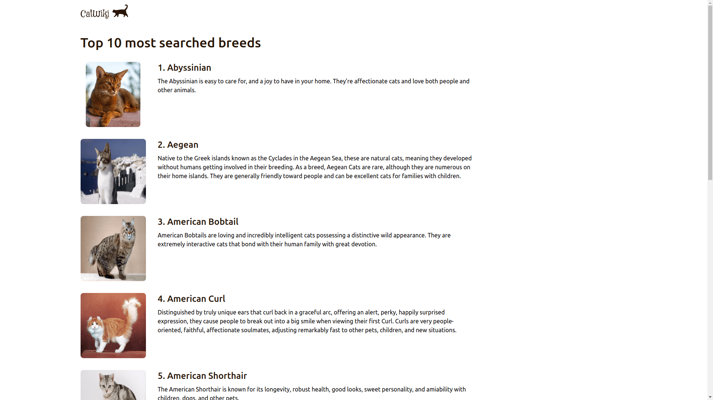

<!-- Please update value in the {}  -->

<h1 align="center">Cat wiki</h1>

<div align="center">
   Solution for a challenge from  <a href="http://devchallenges.io" target="_blank">Devchallenges.io</a>.
</div>

<div align="center">
  <h3>
    <a href="https://cat-wiki-app.herokuapp.com/">
      Demo
    </a>
    <span> | </span>
    <a href="https://github.com/Hussein-Mourad/devchallenges/tree/main/Fullstack/cat-wiki">
      Solution
    </a>
    <span> | </span>
    <a href="https://devchallenges.io/challenges/f4NJ53rcfgrP6sBMD2jt">
      Challenge
    </a>
  </h3>
</div>

<!-- TABLE OF CONTENTS -->

## Table of Contents

- [Table of Contents](#table-of-contents)
- [Overview](#overview)
  - [Built With](#built-with)
- [Features](#features)
- [How To Use](#how-to-use)
- [Acknowledgements](#acknowledgements)
- [Contact](#contact)

<!-- OVERVIEW -->

## Overview





### Built With

<!-- This section should list any major frameworks that you built your project using. Here are a few examples.-->

- [Next.js](https://nextjs.org/)
- [Tailwind](https://tailwindcss.com/)
- [Express.js](https://expressjs.com//)

## Features

<!-- List the features of your application or follow the template. Don't share the figma file here :) -->

This application/site was created as a submission to a [DevChallenges](https://devchallenges.io/challenges) challenge. The [challenge](https://devchallenges.io/challenges/f4NJ53rcfgrP6sBMD2jt) was to build an application to complete the given user stories.

## How To Use

<!-- Example: -->

To clone and run this application, you'll need [Git](https://git-scm.com) and [Node.js](https://nodejs.org/en/download/) (which comes with [npm](http://npmjs.com)) installed on your computer. From your command line:

```bash
# Clone this repository
$ git clone https://github.com/Hussein-Mourad/devchallenges

# change directory
cd Fullstack/cat-wiki/

# Install dependencies
$ npm install

# Run the app
$ npm start
```


## Contact

- Website [hussein.ninja](https://hussein.ninja)
- GitHub [Hussein-Mourad](https://github.com/Hussein-Mourad)
- Twitter [HusseinMourad0](https://twitter.com/HusseinMourad0)
